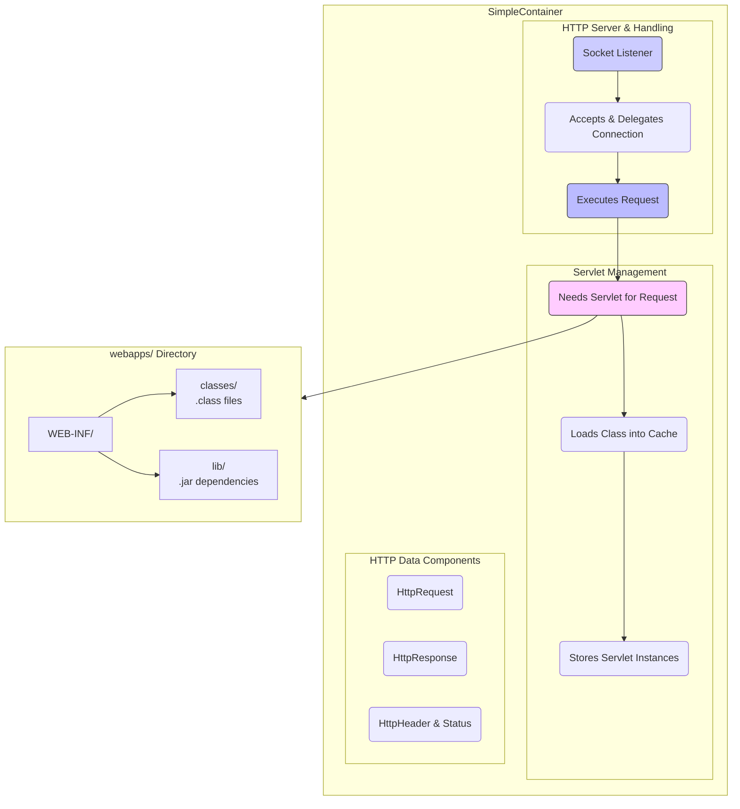

# Browser rendering & Web Application Server

How the web works inside the client and server-side. This project focuses on browser rendering and web server implementation. 🗂️ Built with in Java, Rust, and Python.

## Contents

- [Project Structure](#project-structure)
- [Web Browser Rendering Engine](#web-browser-rendering-engine)
  - [Rendering Pipeline](#rendering-pipeline)
  - [Implementations](#implementations)
  - [Running the Renderer](#running-the-renderer)
  - [Sample Output](#sample-output)  - [Rendering Comparison (Python vs Rust)](#rendering-comparison-python-vs-rust)  - [Bug Fixes (Java Implementation)](#bug-fixes-java-implementation)
- [Simple Container (Web Application Server)](#simple-container-web-application-server)
  - [Architecture](#architecture)
  - [Container Hierarchy](#container-hierarchy-tomcat-like)
  - [Features](#features)
  - [Running the Server](#running-the-server)
  - [API Endpoints](#api-endpoints)
  - [Servlet Implementation](#servlet-implementation)
- [NIO HTTP Client/Server](#nio-http-clientserver)
- [HTTP Protocol Notes](#http-protocol-notes)
- [Development](#development)
- [References](#references)

---

This project consists of three main components:
1. **A toy web browser rendering engine** — Implemented in Java, Rust, and Python
2. **A simple web application server (servlet container)** — Implemented in Java
3. **NIO HTTP Client/Server** — Minimal Java NIO example


*Image from [limpet.net/mbrubeck](https://limpet.net/mbrubeck/2014/08/08/toy-layout-engine-1.html)*

The toy web browser engine is influenced by [limpet.net/mbrubeck's Rust works](https://limpet.net/mbrubeck/2014/08/08/toy-layout-engine-1.html).

**Rendered output of test data with** `perf-rainbow.html` and `perf-rainbow.css`.


## Web Browser Rendering Engine

The rendering engine parses HTML and CSS, builds a style tree, calculates layout, and paints pixels to an image.

### Rendering Pipeline

1. **HTML Parsing** → DOM Tree
2. **CSS Parsing** → Stylesheet
3. **Style Tree** → DOM + CSS Rules applied
4. **Layout Tree** → Box model calculations
5. **Painting** → Pixel output

### Implementations

| Language | Directory | Description |
|----------|-----------|-------------|
| Java | `render/` | Original implementation |
| Rust | `rust/` | Reference implementation |
| Python | `python/` | New implementation |

### Running the Renderer

#### Using Test Scripts

**Windows:**
```batch
render_test.bat python          # Run Python renderer
render_test.bat rust            # Run Rust renderer
render_test.bat all             # Run both and compare

# With custom files
render_test.bat python --html custom.html --css custom.css
```

**Linux/Mac:**
```bash
./render_test.sh python         # Run Python renderer
./render_test.sh rust           # Run Rust renderer
./render_test.sh all            # Run both and compare

# With custom files
./render_test.sh python --html custom.html --css custom.css
```

#### Running Manually

**Python:**
```bash
cd org.web.labs.inside.jerry/src/jerry/python
pip install Pillow  # Required for image output
python main.py -H ../test/test.html -c ../test/test.css -o output.png -v
```

**Rust:**
```bash
cd org.web.labs.inside.jerry/src/jerry/rust
cargo run -- -h ../test/test.html -c ../test/test.css -o output.png
```

**Java:**
```bash
# Compile and run RenderMain.java
# Update file paths in RenderMain.java first
```

---

## Simple Container (Web Application Server)

A lightweight servlet container implementation that combines an HTTP server with a class loader.

### Architecture



### Container Hierarchy (Tomcat)

1. **Engine** - Represents the entire Catalina servlet engine (e.g., Catalina)
2. **Host** - Represents a virtual host with multiple contexts (e.g., localhost)
3. **Context** - Represents a web application with one or more wrappers
4. **Wrapper** - Represents an individual servlet

Each container has Realm (Authentication), Valve (Request/Response processing), and Logger.

### Features

- **Servlet Registration & Caching** - Thread-safe servlet management
- **Configurable Context Path** - Customize webapp location
- **Graceful Shutdown** - Proper resource cleanup
- **Health Check Endpoint** - `/health` returns server status
- **Servlet List Endpoint** - `/servlets` returns registered servlets
- **Query String Parsing** - Full URL parameter support
- **Thread Pool** - Configurable concurrent request handling

### Running the Server

```bash
# Default (port 8080)
java org.web.labs.inside.jerry.was.SimpleContainer

# Custom port and context
java org.web.labs.inside.jerry.was.SimpleContainer -p 9090 -c /path/to/webapps

# Show help
java org.web.labs.inside.jerry.was.SimpleContainer --help
```

### Command Line Options

| Option | Description | Default |
|--------|-------------|---------|
| `-p, --port` | Server port | 8080 |
| `-c, --context` | Context path | ./webapps |
| `-h, --help` | Show help | - |

### API Endpoints

| Endpoint | Method | Description |
|----------|--------|-------------|
| `/servlet/<name>` | GET | Execute a servlet |
| `/health` | GET | Health check (JSON) |
| `/servlets` | GET | List registered servlets (JSON) |
| `/*` | GET | Serve static files |

### Example

Request: `http://localhost:8080/servlet/ToyServlet`


### Servlet Implementation

Create a servlet by implementing the `IToy` interface:

```java
package org.web.labs.inside.jerry.was.toyservlet;

public class MyServlet implements IToy {
    private String name = "MyServlet";
    
    public void setName(String name) { this.name = name; }
    public String getName() { return name; }
    
    @Override
    public String doService() {
        return "<html><h1>Hello from " + name + "</h1></html>";
    }
}
```

### Directory Structure

```
webapps/
└── WEB-INF/
    ├── classes/        # Compiled servlet classes
    └── lib/            # JAR dependencies
```

---

## NIO HTTP Client/Server

The project includes a non-blocking I/O (NIO) implementation for HTTP client and server operations.

### Location

```
org.web.labs.inside.jerry/src/jerry/nio/
├── NIOHttpClient.java  # Non-blocking HTTP client
└── NIOHttpServer.java  # Non-blocking HTTP server
```

### Features

- **Non-blocking I/O** using Java NIO Selectors and Channels
- **State Machine** for HTTP response parsing
- **Chunked Transfer Encoding** support
- **Single-threaded Event Loop** architecture

### Running the NIO Server

```bash
# Default port 8888
java org.web.labs.inside.jerry.nio.NIOHttpServer

# Custom port
java org.web.labs.inside.jerry.nio.NIOHttpServer -p 9999
```

### Running the NIO Client

```bash
# Connect to localhost:8888
java org.web.labs.inside.jerry.nio.NIOHttpClient

# Connect to custom host/port
java org.web.labs.inside.jerry.nio.NIOHttpClient -h example.com -p 80
```

### Endpoints (NIO Server)

| Endpoint | Description |
|----------|-------------|
| `/` | Welcome page with server info |
| `/health` | Health check (JSON) |
| `/echo` | Echoes the request back |

#### Notes on Netty (Production NIO)
- Netty is a production-grade NIO framework offering battle‑tested event loops, backpressure, TLS, HTTP/2, and rich pipeline handlers.
- This repo’s `nio/` server is intentionally minimal for learning: Selector loop, basic parsing, and simple handlers.
- When building real services, prefer Netty for:
    - Robust connection handling and performance tuning across OSes
    - Mature HTTP codecs, chunked streaming, and WebSocket support
    - Extensible pipeline (handlers for logging, compression, TLS, metrics)
- Migration path: keep your request routing and business logic, and swap the low‑level selector code with Netty `ChannelInboundHandler` implementations.

#### NIO vs IO vs Async — What’s the difference?
- **Blocking I/O (IO):** Each connection handled by a dedicated thread; `read()` blocks until data arrives. Simple to reason about, but threads are expensive under high concurrency and can suffer head‑of‑line blocking.
- **Non‑blocking I/O (NIO):** Single (or few) selector loops multiplex many connections; `read()` returns immediately if no data, and readiness is signaled by the selector. Great for thousands of sockets with lower thread counts; requires state machines for partial reads/writes.
- **Async I/O:** OS or runtime completes operations and invokes callbacks/futures/promises. In Java, async often means NIO + completion handlers (e.g., Netty pipeline) or `CompletableFuture`; in Rust/Python it’s typically event loops (`tokio`/`asyncio`). Reduces busy‑waiting and improves latency with structured concurrency.
- **Trade‑offs:**
    - IO → easiest API, highest thread usage, simpler debugging.
    - NIO → scalable with explicit readiness handling, more complex state management.
    - Async → scalable and expressive with backpressure, requires async‑aware libraries and careful design around cancellation/timeouts.

---

## HTTP Protocol Notes

HTTP is based on two-way transfer (request and response). Both consist of:
- **Header** - Metadata (method, path, content-type, etc.)
- **Body** - Content payload

Each line is tokenized by CRLF (`\r\n`).

HTTP 1.1 supports chunked transfer encoding for streaming data:
```
<chunk-size-hex>\r\n
<chunk-data>\r\n
...
0\r\n
\r\n
```

## Development

### Prerequisites

- **Java** - JDK 8 or higher
- **Rust** - For Rust renderer (install via [rustup](https://rustup.rs/))
- **Python 3** - For Python renderer
- **Pillow** - Python image library (`pip install Pillow`)

### Building

```bash
# Java (using javac or your IDE)
javac -d out src/jerry/render/*.java

# Rust
cd org.web.labs.inside.jerry/src/jerry/rust
cargo build --release

# Python (no build needed)
pip install Pillow
```

## References

- [Let's build a browser engine!](https://limpet.net/mbrubeck/2014/08/08/toy-layout-engine-1.html) - Matt Brubeck
- [HTTP Server (Japanese)](http://qiita.com/opengl-8080/items/ca152658a0e52c786029)
- [Understanding of Servlet Container](http://www.hanbit.co.kr/lib/examFileDown.php?hed_idx=1000)


## License

This project is for educational purposes.


