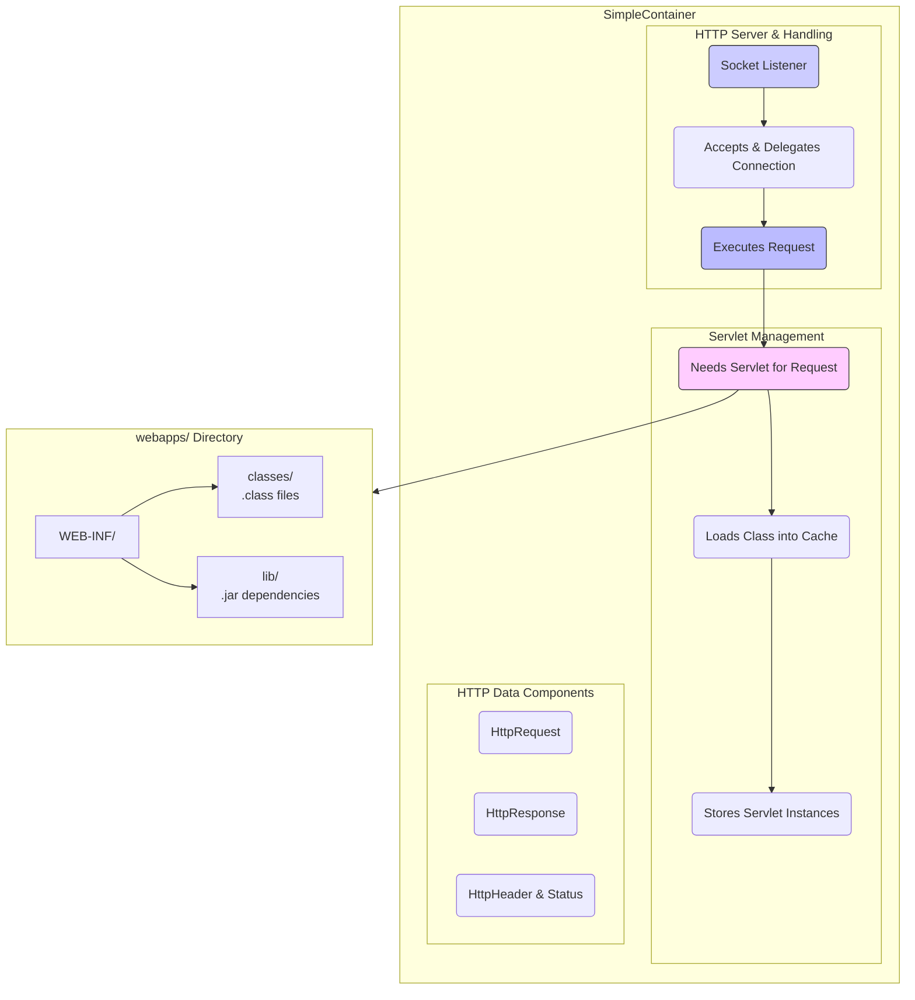
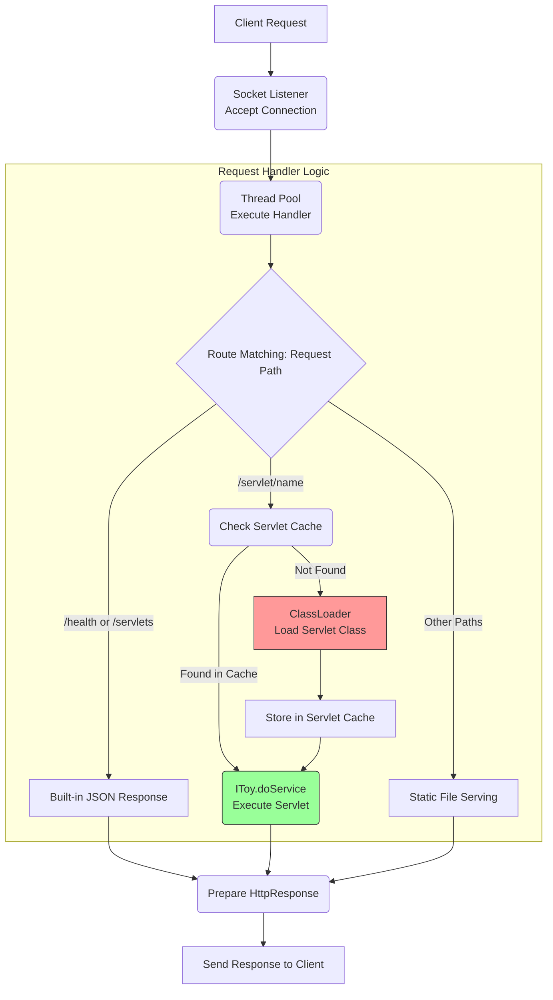

# Jerry Web Renderer & WAS

How the web works inside the client and server-side. This project focuses on browser rendering and web server implementation. 🗂️ Built with in Java, Rust, and Python.

## Contents

- [Project Structure](#project-structure)
- [Web Browser Rendering Engine](#web-browser-rendering-engine)
  - [Rendering Pipeline](#rendering-pipeline)
  - [Implementations](#implementations)
  - [Running the Renderer](#running-the-renderer)
  - [Sample Output](#sample-output)  - [Rendering Comparison (Python vs Rust)](#rendering-comparison-python-vs-rust)  - [Bug Fixes (Java Implementation)](#bug-fixes-java-implementation)
- [Simple Container (Web Application Server)](#simple-container-web-application-server)
  - [Architecture](#architecture)
  - [Container Hierarchy](#container-hierarchy-tomcat-like)
  - [Features](#features)
  - [Running the Server](#running-the-server)
  - [API Endpoints](#api-endpoints)
  - [Servlet Implementation](#servlet-implementation)
- [NIO HTTP Client/Server](#nio-http-clientserver)
- [HTTP Protocol Notes](#http-protocol-notes)
- [Development](#development)
- [References](#references)

---

This project consists of two main components:
1. **A toy web browser rendering engine** - Implemented in Java, Rust, and Python
2. **A simple web application server (servlet container)** - Implemented in Java


*Image from [limpet.net/mbrubeck](https://limpet.net/mbrubeck/2014/08/08/toy-layout-engine-1.html)*

The toy web browser engine is influenced by [limpet.net/mbrubeck's Rust works](https://limpet.net/mbrubeck/2014/08/08/toy-layout-engine-1.html).

## Project Structure

```
jerry-web-render-was/
├── org.web.labs.inside.jerry/
│   └── src/jerry/
│       ├── render/          # Java rendering engine
│       ├── rust/            # Rust rendering engine  
│       ├── python/          # Python rendering engine
│       ├── test/            # Test HTML/CSS files
│       └── was/             # Web Application Server
├── render_test.sh           # Test script (Linux/Mac)
├── render_test.bat          # Test script (Windows)
└── README.md
```

## Web Browser Rendering Engine

The rendering engine parses HTML and CSS, builds a style tree, calculates layout, and paints pixels to an image.

### Rendering Pipeline

1. **HTML Parsing** → DOM Tree
2. **CSS Parsing** → Stylesheet
3. **Style Tree** → DOM + CSS Rules applied
4. **Layout Tree** → Box model calculations
5. **Painting** → Pixel output

### Implementations

| Language | Directory | Description |
|----------|-----------|-------------|
| Java | `render/` | Original implementation |
| Rust | `rust/` | Reference implementation |
| Python | `python/` | New implementation |

### Running the Renderer

#### Using Test Scripts

**Windows:**
```batch
render_test.bat python          # Run Python renderer
render_test.bat rust            # Run Rust renderer
render_test.bat all             # Run both and compare

# With custom files
render_test.bat python --html custom.html --css custom.css
```

**Linux/Mac:**
```bash
./render_test.sh python         # Run Python renderer
./render_test.sh rust           # Run Rust renderer
./render_test.sh all            # Run both and compare

# With custom files
./render_test.sh python --html custom.html --css custom.css
```

#### Running Manually

**Python:**
```bash
cd org.web.labs.inside.jerry/src/jerry/python
pip install Pillow  # Required for image output
python main.py -H ../test/test.html -c ../test/test.css -o output.png -v
```

**Rust:**
```bash
cd org.web.labs.inside.jerry/src/jerry/rust
cargo run -- -h ../test/test.html -c ../test/test.css -o output.png
```

**Java:**
```bash
# Compile and run RenderMain.java
# Update file paths in RenderMain.java first
```

### Sample Output


### Rendering Comparison (Python vs Rust)

Both Python and Rust implementations produce identical rendering results for the common rendering area.

**Test Files:**
- `perf-rainbow2.html` - Nested rainbow divs with 7 color layers
- `perf-rainbow.css` - Block display with 12px padding for all elements

**Comparison Results:**

| Metric | Python | Rust |
|--------|--------|------|
| test.html canvas size | 600×460 | 800×600 |
| perf-rainbow2.html canvas size | 776×240 | 800×600 |
| Common area pixel match | ✅ 100% | ✅ 100% |

> **Note:** Canvas size differences are due to viewport configuration:
> - Python: Derives canvas size from layout tree dimensions
> - Rust: Uses fixed 800×600 viewport

The pixel-perfect match in the common rendering area confirms that both implementations correctly follow the same layout and painting algorithms.

### Bug Fixes (Java Implementation)

The following issues were identified and fixed in the Java implementation to match Rust behavior:

| Issue | Location | Problem | Fix |
|-------|----------|---------|-----|
| `Rect.expanded_by()` | LayoutTree.java | Mutated `this` object instead of returning new Rect | Returns new Rect without mutation |
| Child display type | `build_layout_tree()` | Used parent's display type for children | Now uses child's display type |
| Height accumulation | `layout_block_children()` | Incorrect height reference | Uses `d.content.height` consistently |
| `get_inline_container()` | LayoutTree.java | Returned parent instead of anonymous block | Returns the anonymous block child |
| Canvas alpha | PaintingResult.java | White color alpha was 1 (transparent) | Changed to 255 (opaque) |
| `get_color()` | PaintingResult.java | Returned white for missing colors | Returns null, checks before rendering |

---

## Simple Container (Web Application Server)

A lightweight servlet container implementation that combines an HTTP server with a class loader.

### Architecture



**Request Flow:**



### Container Hierarchy (Tomcat)

1. **Engine** - Represents the entire Catalina servlet engine (e.g., Catalina)
2. **Host** - Represents a virtual host with multiple contexts (e.g., localhost)
3. **Context** - Represents a web application with one or more wrappers
4. **Wrapper** - Represents an individual servlet

Each container has Realm (Authentication), Valve (Request/Response processing), and Logger.

### Features

- **Servlet Registration & Caching** - Thread-safe servlet management
- **Configurable Context Path** - Customize webapp location
- **Graceful Shutdown** - Proper resource cleanup
- **Health Check Endpoint** - `/health` returns server status
- **Servlet List Endpoint** - `/servlets` returns registered servlets
- **Query String Parsing** - Full URL parameter support
- **Thread Pool** - Configurable concurrent request handling

### Running the Server

```bash
# Default (port 8080)
java org.web.labs.inside.jerry.was.SimpleContainer

# Custom port and context
java org.web.labs.inside.jerry.was.SimpleContainer -p 9090 -c /path/to/webapps

# Show help
java org.web.labs.inside.jerry.was.SimpleContainer --help
```

### Command Line Options

| Option | Description | Default |
|--------|-------------|---------|
| `-p, --port` | Server port | 8080 |
| `-c, --context` | Context path | ./webapps |
| `-h, --help` | Show help | - |

### API Endpoints

| Endpoint | Method | Description |
|----------|--------|-------------|
| `/servlet/<name>` | GET | Execute a servlet |
| `/health` | GET | Health check (JSON) |
| `/servlets` | GET | List registered servlets (JSON) |
| `/*` | GET | Serve static files |

### Example

Request: `http://localhost:8080/servlet/ToyServlet`


### Servlet Implementation

Create a servlet by implementing the `IToy` interface:

```java
package org.web.labs.inside.jerry.was.toyservlet;

public class MyServlet implements IToy {
    private String name = "MyServlet";
    
    public void setName(String name) { this.name = name; }
    public String getName() { return name; }
    
    @Override
    public String doService() {
        return "<html><h1>Hello from " + name + "</h1></html>";
    }
}
```

### Directory Structure

```
webapps/
└── WEB-INF/
    ├── classes/        # Compiled servlet classes
    └── lib/            # JAR dependencies
```

---

## NIO HTTP Client/Server

The project includes a non-blocking I/O (NIO) implementation for HTTP client and server operations.

### Location

```
org.web.labs.inside.jerry/src/jerry/nio/
├── NIOHttpClient.java  # Non-blocking HTTP client
└── NIOHttpServer.java  # Non-blocking HTTP server
```

### Features

- **Non-blocking I/O** using Java NIO Selectors and Channels
- **State Machine** for HTTP response parsing
- **Chunked Transfer Encoding** support
- **Single-threaded Event Loop** architecture

### Running the NIO Server

```bash
# Default port 8888
java org.web.labs.inside.jerry.nio.NIOHttpServer

# Custom port
java org.web.labs.inside.jerry.nio.NIOHttpServer -p 9999
```

### Running the NIO Client

```bash
# Connect to localhost:8888
java org.web.labs.inside.jerry.nio.NIOHttpClient

# Connect to custom host/port
java org.web.labs.inside.jerry.nio.NIOHttpClient -h example.com -p 80
```

### Endpoints (NIO Server)

| Endpoint | Description |
|----------|-------------|
| `/` | Welcome page with server info |
| `/health` | Health check (JSON) |
| `/echo` | Echoes the request back |

---

## HTTP Protocol Notes

HTTP is based on two-way transfer (request and response). Both consist of:
- **Header** - Metadata (method, path, content-type, etc.)
- **Body** - Content payload

Each line is tokenized by CRLF (`\r\n`).

HTTP 1.1 supports chunked transfer encoding for streaming data:
```
<chunk-size-hex>\r\n
<chunk-data>\r\n
...
0\r\n
\r\n
```

---

## Development

### Prerequisites

- **Java** - JDK 8 or higher
- **Rust** - For Rust renderer (install via [rustup](https://rustup.rs/))
- **Python 3** - For Python renderer
- **Pillow** - Python image library (`pip install Pillow`)

### Building

```bash
# Java (using javac or your IDE)
javac -d out src/jerry/render/*.java

# Rust
cd org.web.labs.inside.jerry/src/jerry/rust
cargo build --release

# Python (no build needed)
pip install Pillow
```

---

## References

- [Let's build a browser engine!](https://limpet.net/mbrubeck/2014/08/08/toy-layout-engine-1.html) - Matt Brubeck
- [HTTP Server (Japanese)](http://qiita.com/opengl-8080/items/ca152658a0e52c786029)
- [Understanding of Servlet Container](http://www.hanbit.co.kr/lib/examFileDown.php?hed_idx=1000)

---

## License

This project is for educational purposes.


